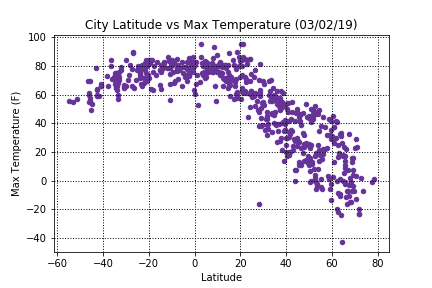
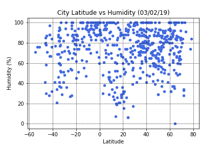
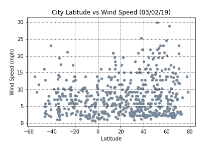
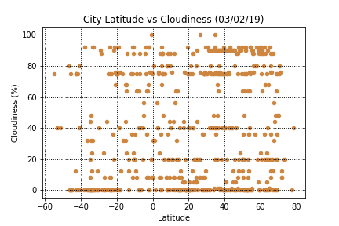

ANALYSIS:

• As expected the hottest temperatures are being seen on the northern hemisphere given the inverse seasonal relationship.

• Humidity appears to increase the closer we move to zero latitude.

• Latitude appears to have no visible influence on either wind speed and cloudiness.
 

• Taking a closer look through gmaps, we can see a very well distributed sample of randomly selected cities
  How latitude impacts temperature, humidity, wind, and clouds.

